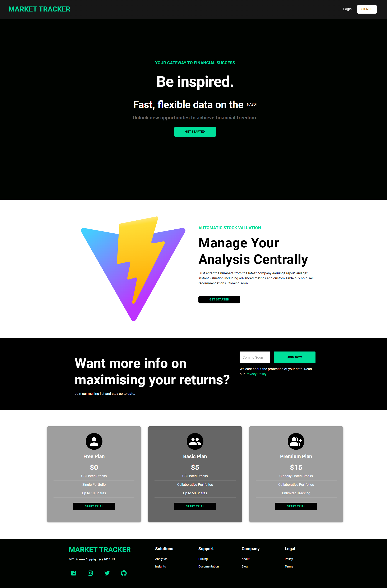
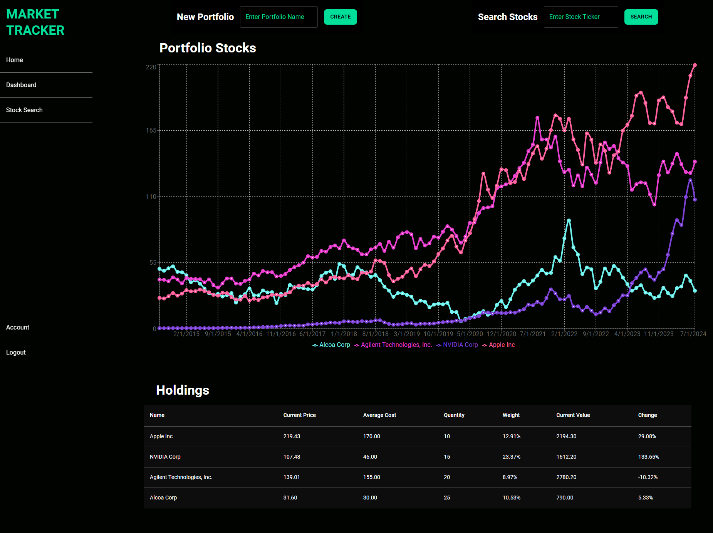

# Market Tracker

## The Project

This project was designed as a way for user to be able to query historical data on different stocks and then add "shares" in these stocks to different dummy portfolios in order to track trends, categories or anything else they can think of. Other features include:

-   Third party Api providing real data on over 20,000 US listed stocks.
-   Partially mobile responsive.
-   JWT authentification.

## Link & Contents

-   [The Deployed Page](https://market-tracker-9xfh.onrender.com)
-   [Installation](#installation)
-   [Usage](#usage)
-   [Future Development](#future-development)
-   [Credits](#credits)
-   [Questions and Feedback](#questions-and-feedback)
-   [License](#license)

## Images

Welcome Page

Dashboard Page

## Installation

This site is live on the web so no installation is necessary.

## Usage

Just click the following [link](https://market-tracker-9xfh.onrender.com), and have a look around!

## Future Development

Ideas for future development include:

-   Adding all the basic functionality I missed
-   Show trending themes/topics
-   Automatic customisable valuations
-   Making group/collaborative accounts/portfolios
-   Making all pages mobile responsive
-   Crontab or similar for automatic data updates
-   Unit tests
-   Web socket for live price updates
-   Additional user settings such as currency and controlling colour theme
-   Stripe payments for subscriptions
-   Pwa
-   Configuring most front end functions to run through reducer

## Credits

Project requirements provided by edX/Monash University.

Project set by edX/Monash University. Made use of the Xpert learning assistant, AskBcs and our instructor with troubleshooting issues.

Chat Gpt for assisting with mui styling and converting js into typescript.

GitHub for hosting the repository.

[Render](https://render.com) for hosting the deployed page.

[MongoDb](https://www.mongodb.com) for hosting the deployed page.

## Questions and Feedback

If you find any issues or have contributions or feedback you can do so by opening an [issue](https://github.com/Jiske-N/market-tracker/issues) on Github.

## License

MIT License

Copyright (c) 2024 JN
